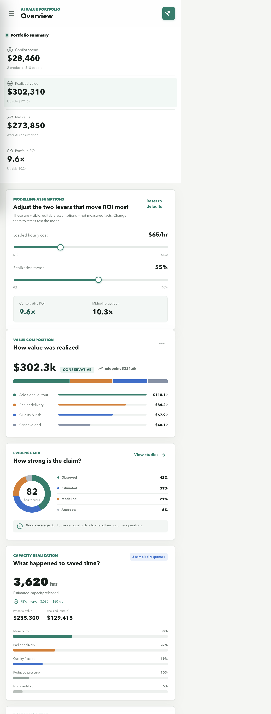
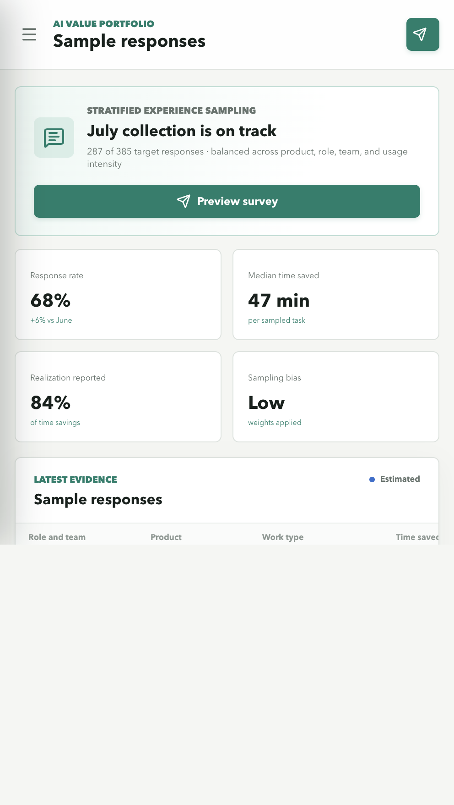
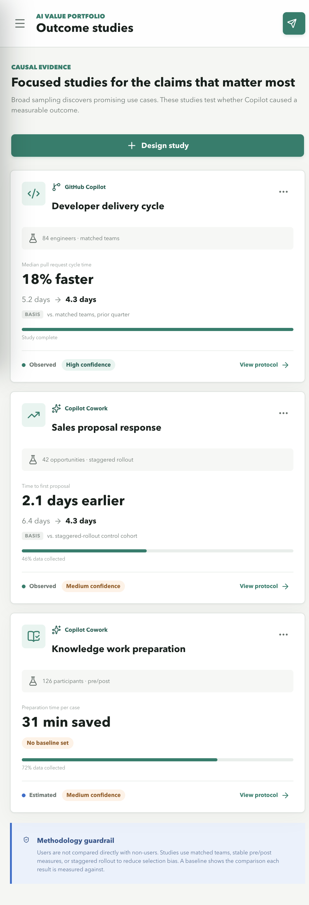

# Proofline: Copilot Value Evidence MVP

Proofline is a working prototype for measuring the business value of consumption-priced AI products, initially Microsoft Copilot Cowork and GitHub Copilot. It combines cost and usage data with lightweight experience sampling, explicit business hypotheses, and focused outcome studies.

The objective is not to manufacture a single precise-looking ROI number. It is to create a transparent body of evidence showing what was spent, what changed, what business result followed, and how confident the organization should be in each claim.

## Screenshots

### Portfolio overview



| Experience sampling | Outcome studies |
| --- | --- |
|  |  |

## Why This Approach Works

- **It separates "time saved" from "value realized".** Most Copilot ROI decks stop at "users saved X hours" and quietly multiply by a salary rate. That number is almost always wrong, because saved time only becomes money if it is actually reconverted into output, headcount avoidance, or faster revenue. Making realization an explicit, separate step is the single most defensible part of this design.
- **It samples instead of logging everything.** Representative sampling respects people's time and avoids the "every Jira ticket now has two mandatory AI fields" fatigue that erodes data quality. It also captures knowledge work performed outside Jira, which universal ticket logging would miss entirely.
- **It grades the evidence (Observed / Estimated / Modelled / Anecdotal).** Labelling how each claim is supported is intellectually honest and travels well with a skeptical CFO. It keeps the strong operational results distinct from softer self-reported estimates, so no one has to pretend a modelled figure is a measured one.

## The Use Case

Product telemetry can usually answer questions such as:

- How much Copilot was consumed and what it cost.
- How many people used it and how frequently.
- Which features were used or how many suggestions were accepted.

Those measures are useful for adoption and cost governance, but they cannot establish that the assisted work was valuable, that Copilot caused an improvement, or that saved time was converted into a business result.

For example, accepting more code suggestions does not necessarily mean that a team released software earlier. Saving an hour drafting a document does not necessarily create an hour of cash savings. The value depends on what the improvement enabled: additional output, earlier delivery, avoided cost, better quality, lower risk, or reduced operational pressure.

Asking every employee to record AI use and estimate time saved on every Jira issue would provide more context, but it would also create substantial administrative burden and response fatigue. It would not cover knowledge work performed outside Jira, particularly work assisted by Copilot Cowork.

## Measurement Approach

Proofline separates the evidence chain into four levels:

1. **Consumption:** What did Copilot cost?
2. **Activity:** Which products and broad work categories were used?
3. **Effect:** Did AI change speed, quality, scope, confidence, or risk?
4. **Realized value:** Did that effect produce additional output, earlier delivery, avoided cost, improved quality, or reduced risk?

The headline model is:

$$
	ext{Net realized value} =
	ext{additional output} +
	ext{earlier delivery value} +
	ext{cost avoided} +
	ext{quality/risk value} -
	ext{AI cost} -
	ext{change cost}
$$

Potential capacity value can be estimated as:

$$
	ext{Potential capacity value} =
	ext{hours saved} \times
	ext{loaded hourly cost}
$$

That estimate must be qualified by what happened to the released capacity. Proofline therefore records the enabled outcome rather than treating all reported time savings as realized financial value.

## What the MVP Includes

### Portfolio overview

The overview connects Copilot spend to realized and net value. It shows:

- Conservative (confidence-adjusted) spend, realized value, net value, and ROI, with the midpoint shown as upside.
- Value composition across additional output, earlier delivery, quality and risk, and avoided cost.
- The mix and strength of supporting evidence.
- Estimated capacity released, confidence intervals, and how that capacity was used.
- Editable modelling assumptions that recompute every headline number live.
- Team-level results with product, spend, value, ROI, confidence, and trend.

The current figures are illustrative seed data. They demonstrate the intended reporting model and must not be interpreted as customer results.

### Editable modelling assumptions

Two assumptions drive the financial model more than any other input: the **loaded hourly cost** of the people using Copilot, and the **realization factor** — the share of freed capacity that is actually converted into output, headcount avoidance, or faster revenue. Both are exposed as sliders on the overview, and every headline figure recomputes live as they move. Changes are persisted so a reviewer's settings stick.

Why this matters: the realization factor and loaded hourly cost are the two levers that swing ROI the most. Letting a finance reviewer change them and watch the number move turns the dashboard from an assertion into a model. A model people can stress-test themselves is trusted; a fixed number is argued with. Exposing the levers also keeps the assumptions visible and auditable rather than buried in a spreadsheet.

### Conservative headline ROI

The headline spend-to-value figures — realized value, net value, and ROI — are reported at the **low end** of the estimate interval, with the **midpoint shown separately as upside**. The capacity estimate carries a 95% interval, and the conservative headline uses its lower bound.

Why this matters: add a confidence-adjusted, conservative ROI rather than only the midpoint. Report the low end of the interval as the headline and the midpoint as upside, because under-claiming and being right beats over-claiming and getting audited. Leading with the low end keeps the number credible with a skeptical CFO and protects the whole business case if a single assumption is later challenged.

### Stratified experience sampling

The sample-response workflow replaces a mandatory question on every work item with a short, occasional prompt. It captures:

- Product and broad work type.
- Role and team for aggregation and weighting.
- A time-saving range rather than false minute-level precision.
- Whether speed, quality, scope, confidence, or risk changed.
- The downstream outcome enabled by that improvement.

In production, invitations would be selected across product, role, team, usage intensity, and adoption maturity. This is more representative than relying only on volunteers or people requesting higher consumption limits.

The MVP includes a functional 30-second survey. Submitted responses are saved in browser storage and immediately appear in the response table.

### Value hypothesis registry

Managers can register a small number of quarterly, testable claims connecting:

`AI-assisted use case -> expected effect -> business outcome -> evidence source`

This shifts the burden away from employees and makes the value mechanism explicit before results are examined. New hypotheses are persisted in browser storage.

### Outcome studies

Three study patterns are represented:

- Developer delivery cycle using matched engineering teams.
- Knowledge-work preparation using stable pre/post measures.
- Sales proposal response using a staggered rollout.

Focused studies are appropriate for high-value claims because they provide stronger causal evidence than a comparison of users and non-users. Direct comparisons are vulnerable to selection bias: early adopters may already be more experienced, motivated, or better managed.

Each study can carry an optional baseline: a before value, the resulting value, and the comparison basis it is measured against (matched teams, pre/post period, or staggered-rollout cohort). Studies with a baseline are ranked first, and studies without one are explicitly marked "No baseline set" so the gap is visible rather than hidden. The baseline is optional by design, because forcing one on an incomplete study would invite fabricated comparisons.

### Evidence grading

Claims are labelled rather than presented as equally certain:

- **Observed:** supported by an operational business measure.
- **Estimated:** supported by representative sampled responses.
- **Modelled:** calculated using visible financial assumptions.
- **Anecdotal:** supported by a case or individual account.

The dashboard's evidence-health view makes gaps visible and directs investment toward the studies most likely to strengthen a decision.

### CSV ingestion and employee mapping

The import workflow accepts CSV files for GitHub Copilot, Microsoft 365 consumption, and employee-to-team mapping. Files are parsed with Papa Parse and checked for recognized fields such as `product`, `team`, `role`, `user`, `consumption`, and `cost`.

The prototype records import metadata and mapping status. It does not upload files to a server or inspect prompts, message content, documents, or source code.

## Why This Is Appropriate

The solution uses different evidence for different questions:

| Question | Appropriate evidence |
| --- | --- |
| What did Copilot cost? | Consumption and billing exports |
| Where is it being used? | Aggregate product telemetry |
| What changed for users? | Short, stratified experience samples |
| Did an operational result improve? | Business-system metrics and outcome studies |
| Was released capacity converted into value? | Team-level realization review |
| How reliable is the claim? | Evidence grade, confidence, and visible assumptions |

This design is useful because it:

- Reduces employee burden by sampling rather than prompting on every task.
- Covers work inside and outside Jira.
- Separates adoption from value and potential time savings from realized outcomes.
- Avoids using high-consumption exception requests as a biased proxy for value.
- Makes uncertainty explicit through ranges, evidence labels, and confidence levels.
- Exposes the assumptions that drive ROI as editable levers, so the model can be stress-tested rather than argued with.
- Leads with a conservative, confidence-adjusted headline and treats the midpoint as upside.
- Provides evidence for allocation decisions without turning the product into employee surveillance.

Consumption thresholds can still be used as governance triggers, but should generally be soft thresholds. A high-cost pattern can trigger sampling or review without interrupting valuable work or making paperwork tolerance the measure of value.

## Privacy Principles

The MVP communicates four intended production controls:

- Aggregate reporting by default.
- No prompt, document, message, or source-code inspection.
- Minimum group-size thresholds before reporting team results.
- Role-based access for portfolio owners, managers, and study analysts.

Production deployments should also define retention periods, pseudonymize user identifiers, document permitted purposes, and involve employee representatives and privacy teams before activation.

## Prototype Architecture

The application is a React and TypeScript single-page app built with Vite. It uses:

- `localStorage` for prototype response, hypothesis, import, and assumption persistence.
- Papa Parse for structured CSV processing.
- Lucide React for interface icons.
- Seeded portfolio, study, and evidence data for an immediately usable demonstration.

No backend, tenant authentication, Microsoft Graph connection, GitHub API connection, Teams bot, or production statistical engine is included. Those are deliberate MVP boundaries rather than simulated integrations.

## Production Path

A production implementation would add:

1. Entra ID authentication and role-based access control.
2. A governed database with tenant isolation, retention controls, and audit history.
3. Scheduled aggregate imports from Microsoft and GitHub reporting APIs.
4. HR or identity mapping with pseudonymous identifiers and minimum group sizes.
5. A sampling service that balances role, team, product, and usage strata.
6. Teams adaptive-card delivery with reminders and opt-out controls.
7. Statistical weighting, non-response analysis, and confidence intervals calculated from real samples.
8. Connectors to Jira, deployment systems, CRM, case management, and finance data.
9. Configurable realization assumptions with approval and version history.

## Run Locally

Requirements: a current Node.js release and npm.

```bash
npm install
npm run dev
```

Open the local URL printed by Vite, normally `http://localhost:5173`.

To validate a production build:

```bash
npm run build
npm run lint
```
